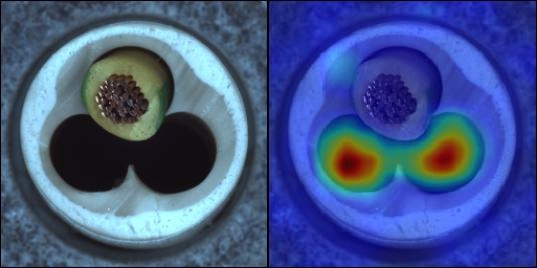

# Self-supervised Context Learning for Visual Inspection of Industrial Defects

The code will be released soon.

We address the challenge of detecting object defects through the self-supervised learning approach of solving the jigsaw puzzle problem.

## Results
